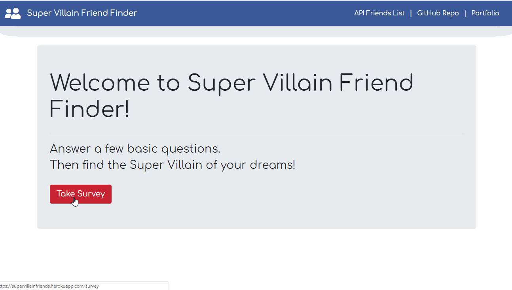

# Super Villain Friend Finder
Express & Node come together on Heroku to help you find your new bestie.

## Demonstration


## Requirements
- Modularity in the form of separate files for server logic, storing of friends and routing.
- Ten question survey to assess the uniqueness of users.
- Use the following NPM Packages:
     - `express`
     - `body-parser`
     - `path`

## Technologies Used

- JavaScript
- jQuery
- Node
- Express
- HTML/CSS
- Bootstrap

## Code Explanation

- Our `server.js` file sets up the Express server, specifying our port number, the npm packages that need to be loaded, and the routes which route traffic to the proper page.
- There are 2 separate HTML files (`home.html` & `survey.html`) that serve as the front-end portion of our code. They determine what the user "sees" (the homepage and survey which will also show the resulting best match).
- Our 2 routing files (`htmlRoutes.js` & `apiRoutes.js`) determine the back-end logic (based on the request being made, the response gets sent to the browser).
     - The HTML routes display the survey and the homepage based on the URL that is accessed, and the homepage based on the URL that is accessed, and the API routes send back existing content in our server side data or add new friends.
- Best match is calculated by finding the friend with the minimal difference in scores and then sending that friend to the browser as a JSON object.
- A modal is then toggled, displaying the best match to the person who jus ttoo the surve.
- In essence, this will also be a form of notes you may later reference.

- Friends are stored as such:
```
{
     name: "Dr. Doom",
     photo: "https://upload.wikimedia.org/wikipedia/en/6/60/Doctor_Doom_%282018%29.jpg",
     scores: [4,2,3,2,3,2,2,5,4,3]
}
```

## Meta

Distributed under the MIT License. See [LICENSE](LICENSE) for more information.

[https://github.com/jobu206/github-link](https://github.com/job206/)


## Contributing

1. Fork it (<https://github.com/jobu206/FriendFinder/fork>)
2. Create your feature branch (`git checkout -b feature/FriendFinder`)
3. Commit your changes (`git commit -am 'Add some yourMessageHere'`)
4. Push to the branch (`git push origin feature/FriendFinder`)
5. Create a new Pull Request